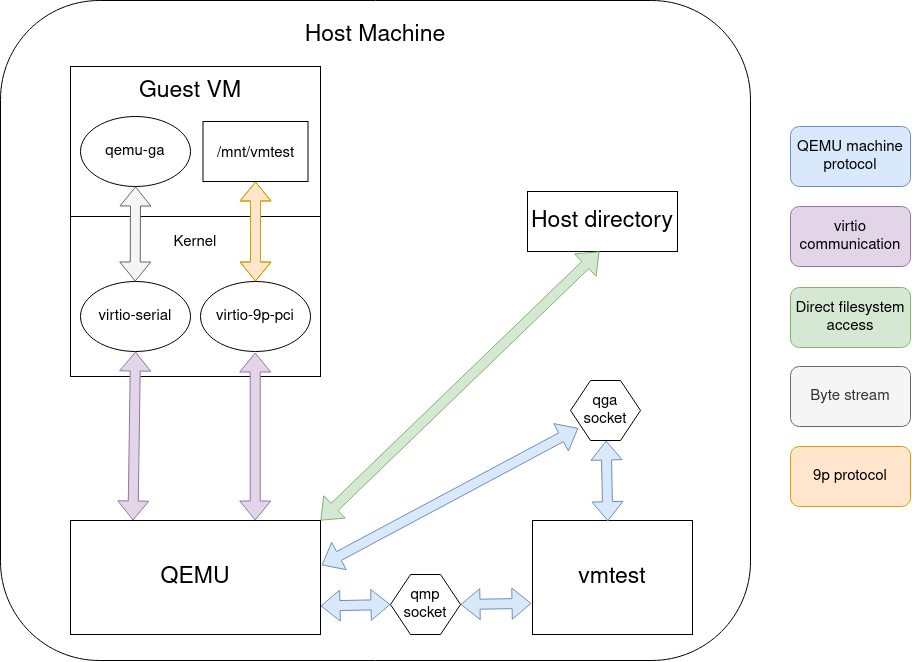

# Architecture

The first big idea is that `vmtest` tries to orchestrate everything through
QEMU's programmable interfaces, namely the QEMU machine protocol (QMP) for
orchestrating QEMU and qemu-guest-agent (which also uses QMP under the hood)
for running things inside the guest VM. Both interfaces use a unix domain
socket for transport.

For image targets, we require that `qemu-guest-agent` is installed inside the
image b/c it's typically configured to auto-start through udev when the
appropriate virtio-serial device appears. This gives vmtest a clean out-of-band
mechanism to execute commands inside the guest. For kernel targets, we require
qemu-guest-agent is installed on the host so that after rootfs is shared into
the guest, our custom init (PID 1) process can directly run it as the one and
only "service" it manages.

The second big idea is that we use 9p filesystems to share host filesystem
inside the guest. This is useful so that vmtest targets can import/export data
in bulk without having to specify what to copy. In a kernel target, vmtest
exports two volumes: `/mnt/vmtest` and the root filesystem. The latter export
effectively gives the guest VM the same userspace environment as the host,
except we mount it read-only so the guest cannot do too much damage to the
host.
